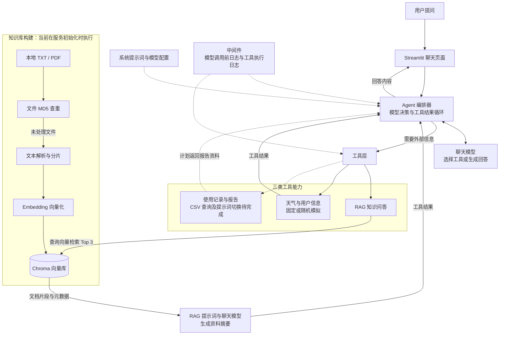

# 扫地机器人智能客服 Agent：项目梳理与面试讲稿

整理日期：2026-09-08。范围以 `E:/AI/ai-agent/agent` 为主，并说明与仓库其他目录的关系。

本文依据当前源码静态梳理。架构图表示模块职责与设计调用路径，**不代表当前版本已全部跑通**。目前存在配置访问、RAG 输出解析器、报告中间件等接线问题；业务工具包含模拟数据。本轮只整理文档，未修改业务代码，未调用模型或执行知识库入库。

## 1. 用一句话介绍项目

这是一个围绕扫地机器人使用咨询设计的智能客服学习项目：通过 LangChain Agent 选择工具，结合本地知识库检索、环境信息和用户使用记录，组织回答；用 Streamlit 提供聊天交互。

介绍自己的贡献时，只把实际完成、理解并能解释的工作说成自己的实现；课程提供的部分说明是在课程基础上学习和扩展。

## 2. 先分清仓库里的三组代码

| 目录 | 内容与定位 | 面试如何组织 |
| --- | --- | --- |
| [src](E:/AI/ai-agent/src) | 模型调用、Prompt、Chain、向量存储、历史消息等基础练习 | 作为学习过程，不逐个脚本展开 |
| [app](E:/AI/ai-agent/app) | 独立 RAG 原型：文本上传、分片入库、检索问答、LangGraph + SQLite 会话存储 | 可说明自己另外实践过持久化会话；没有自动接入 Agent |
| [agent](E:/AI/ai-agent/agent) | 扫地机器人客服：Agent、工具、RAG、中间件、配置及聊天入口 | 本次项目讲解的主线 |

`agent` 中的 `01_index.py`、`02_tool.py`、`03_middleware.py` 是独立练习入口。综合项目从 [web.py](E:/AI/ai-agent/agent/web.py:1) 开始阅读。

## 3. 一张图看整体架构

实线表示源码中的主要模块关系；虚线用于配置、日志辅助关系以及标为“待完成”的报告分支。所有路径均为静态设计梳理，运行阻塞见第 8 节。

讲图的顺序：**入口 → Agent → 三类工具 → RAG 的在线检索与知识库构建 → 中间件 → 当前边界**。

关键理解：Agent 负责决定下一步调用哪个工具；RAG 是其中一个工具，负责提供基于资料的回答。`ReactAgent` 里的 ReAct 指推理与行动循环，和前端 React 框架无关。项目通过框架组织模型与工具消息，没有自己实现模型训练或底层推理算法。

## 4. 一次知识问答如何流转

以“扫地机器人清扫后仍有灰尘，应该检查什么？”为讲解示例。下面是设计流程，未声称该问题已在当前数据上验证成功。

1. **接收问题。** `web.py` 接收输入，保存到页面会话状态，调用 `ReactAgent.execute_stream(prompt)`。
2. **交给 Agent。** Agent 获得当前问题、系统提示词及工具定义，由聊天模型判断是否调用工具，也可能直接回答。
3. **选择知识检索工具。** 如果模型选择 `rag_summarize`，框架执行该 Python 工具，把检索词传给 RAG 服务。
4. **检索相关资料。** Chroma 使用配置的 Embedding 模型向量化查询，检索 Top 3 文档片段。
5. **根据资料生成摘要。** RAG 服务将问题、片段正文、元数据填入提示词，再调用聊天模型，设计上返回字符串摘要。
6. **继续决策或回答。** 摘要作为工具结果返回 Agent，模型决定继续调用工具或生成用户回答。
7. **展示结果。** 页面消费 Agent 的输出迭代器并展示内容。

这里有两层模型使用：外层 Agent 用模型决策和回答，内层 RAG 用模型总结资料。一次问答可能发生多次模型调用，因此后续需要测量延迟和费用，再判断是否改为直接向 Agent 返回检索片段。

当前 Agent 用的是 `stream_mode="values"`，代码取状态更新中的最后一条消息内容；这不等于已经实现逐 token 输出，也尚未严格区分工具消息与最终回答。

## 5. 知识库如何构建

这条流程负责准备可检索资料，与在线回答在职责上分开。**当前代码将构建逻辑放在 `VectorStoreService.__init__`，尚未拆成独立离线任务。**

| 步骤 | 当前实现 | 面试时说明的目的 |
| --- | --- | --- |
| 扫描文件 | 读取配置目录下一层 TXT / PDF；当前 `agent/data` 未见文件 | 明确知识来源；目前不是网页搜索，也没有自动读取 `app/data` |
| MD5 查重 | 按文件内容哈希查询已处理记录 | 跳过内容完全相同的文件，减少重复入库与向量化 |
| 提取文本 | TXT 读取正文；PDF 按页提取文字，保留来源与页码 | 保留上下文来源；扫描图片 PDF 尚无 OCR |
| 文本分片 | `RecursiveCharacterTextSplitter`；长度 200，重叠 20，按 `len` 计算 | 控制检索粒度；重叠用于保留相邻片段上下文 |
| 向量化入库 | Embedding 模型 + Chroma | 将文本转成可做语义相似度检索的向量 |
| 记录处理状态 | 成功入库后保存 MD5 | 下次初始化可以跳过已处理文件 |

当前 `k=3` 表示召回数量，不是相似度阈值。分片参数和 Top K 都是当前配置值，尚无评测证明它们最优。MD5 去重也不等于版本管理：文件修改后如何删除旧片段、删除文件后如何同步清理索引，还需补充策略。

## 6. 模块和源码对应关系

| 模块 | 关键文件 | 负责什么 |
| --- | --- | --- |
| 交互层 | [web.py](E:/AI/ai-agent/agent/web.py:1) | 聊天输入、页面历史、等待状态、迭代输出展示 |
| Agent 编排 | [react_agent.py](E:/AI/ai-agent/agent/tool/react_agent.py:9) | 组装模型、Prompt、7 个工具和中间件；提交本轮问题 |
| 工具定义 | [index.py](E:/AI/ai-agent/agent/tool/index.py:50) | RAG、天气、位置、用户 ID、月份、使用记录、报告模式标记 |
| 中间件 | [middleware.py](E:/AI/ai-agent/agent/tool/middleware.py:12) | 工具调用日志、异常记录、模型调用前日志、报告标记更新 |
| RAG 服务 | [rag_service.py](E:/AI/ai-agent/agent/rag/rag_service.py:13) | 检索文档、拼接上下文、调用模型生成摘要 |
| 向量库 | [vector_store.py](E:/AI/ai-agent/agent/rag/vector_store.py:14) | 文档分片、查重、向量入库与 Retriever |
| 模型工厂 | [factory.py](E:/AI/ai-agent/agent/model/factory.py:11) | 分别构造聊天模型和 Embedding 模型，集中管理接入配置 |
| 配置与提示词 | [config](E:/AI/ai-agent/agent/config)、[prompts](E:/AI/ai-agent/agent/prompts) | 模型配置、检索参数、文件路径、系统与 RAG 提示词 |
| 公共辅助 | [utils](E:/AI/ai-agent/agent/utils) | 配置加载、路径、日志、文件解析、哈希计算 |

项目通过 `ChatOpenAI` 和 `OpenAIEmbeddings` 接入配置的兼容服务。SDK 名称不等于实际模型提供方；当前配置将聊天与 Embedding 指向不同服务，实际可用性仍需运行验证。

## 7. 可以如何回答面试追问

**为什么同时使用 Agent 和 RAG？**

业务既包含知识咨询，也设计了环境与使用记录查询。Agent 用来选择工具，RAG 专门处理资料问答。如果场景只有固定的知识检索问答，可以直接使用 RAG，减少决策过程。

**工具是怎么让模型调用的？**

Python 函数通过 `@tool` 暴露名称、描述与参数信息。模型输出工具调用请求，框架负责执行函数并把结果作为工具消息送回模型。描述帮助模型选择工具，参数类型帮助形成调用结构；真实业务仍需要在服务端校验参数和权限。

**怎么减少没有依据的回答？**

当前设计是检索业务资料，并用 RAG 提示词约束模型根据资料作答。提示词本身不能保证正确，后续需要补无结果处理、引用展示和评测集。目前还不能说已经消除了幻觉。

**中间件有什么作用？**

把调用日志等公共逻辑放在业务工具外面。当前工具执行前记录名称与参数，成功后记录结果状态，异常时记录并重新抛出；模型调用前记录消息数量。尚未实现自动重试、超时降级或完整链路追踪。

**是否支持多轮记忆？**

同一次 Agent 调用内部，会围绕问题和工具结果继续决策。跨用户轮次方面，当前 `agent` 只在页面保存历史，提交给模型的仍是本轮问题，未接入持久化记忆。仓库的独立 `app` 原型另有 LangGraph + SQLite 会话实现。

**报告功能是怎么设计的？**

设计上先取得用户与月份，再调用 `fill_context_for_report`，中间件把本次运行的 `report` 标记改为 `True`，之后切换报告提示词，并查询本地 CSV 资料。当前报告提示词、配置和中间件接线尚未完成，只能介绍设计。

**五次工具调用上限在哪里控制？**

当前只写在系统提示词中，未见显式的计数拦截，不能称为程序硬限制。需要在执行层控制次数、超时和终止结果。

**目前项目能证明什么？**

能展示对工具调用、RAG、向量入库、配置拆分及调用日志的代码实践。上线稳定性、准确率、并发和费用还需要实际运行与测试数据来证明。

## 8. 当前完成度与演示前检查

以下是静态源码中可直接看到的关键问题，便于准备演示；不等于完整运行故障清单。

| 项目 | 当前证据与影响 | 演示前应完成 |
| --- | --- | --- |
| 模型配置访问 | `config_handler.py` 用 YAML 加载配置为字典；`factory.py` 多处使用 `rag_conf.chat_model_name` 等属性访问 | 统一字典取值方式，确认模型对象可以构造 |
| RAG 输出解析器 | `rag_service.py:23` 将 `StrOutputParser` 类直接接入 Chain，未实例化 | 修正解析器接线，验证摘要输出为字符串 |
| 报告中间件 | `react_agent.py:6` 导入的 `middleware.report_prompt_switch` 是空函数；带装饰器的实现位于 `tool/index.py:90` | 统一并接入有效中间件；先验证 Agent 可初始化 |
| 知识与报告数据 | 当前 `agent/data` 未见文件；`agent.yml` 与 `report_prompt.txt` 为空 | 补可解释的演示资料、CSV 路径和报告提示词 |
| 业务数据真实性 | 天气固定返回；城市、用户 ID 和月份随机选择 | 用固定演示身份与数据，明确 Mock 边界，或接入实际接口 |
| CSV 读取 | 字符串按逗号拆分，且月份赋值放在“新用户”分支中 | 正确处理 CSV 格式和同一用户多月记录 |
| 会话与输出 | 只提交本轮问题；读取最后一条状态消息；页面保存最后一个输出块 | 验证跨轮上下文、消息类型过滤、空输出与完整回答保存 |

还应统一启动方式与导入路径：当前混用了 `agent.*` 和 `tool.*`、`rag.*`、`model.*`。Chroma 的持久化路径也是相对工作目录的配置值。本文没有给出“已验证启动命令”，避免将静态梳理当作运行确认。

## 9. 两分钟口述稿

下面是一份基于当前完成度的讲解示例，可以按自己的真实贡献调整：

> 这是我学习 Agent 开发时实践的一个扫地机器人客服项目。场景上，我把用户需求分成知识咨询、环境信息查询和个人使用报告三类。
>
> 整体上，Streamlit 负责聊天交互，LangChain Agent 负责根据问题选择工具。工具执行后把结果交回模型，再由模型决定继续查询还是生成回答。
>
> 知识问答部分，我把 RAG 封装成一个工具。知识库构建的设计是读取本地 TXT 或 PDF，按文件 MD5 跳过重复内容，再把文档分片、向量化后存入 Chroma。在线问答时检索相关片段，把问题和资料交给模型总结，摘要再返回 Agent。
>
> 工程结构上，项目将模型工厂、配置、提示词、工具和日志拆开。中间件记录模型和工具调用，便于定位问题。
>
> 当前这是一个开发中的学习项目。天气与用户信息仍使用模拟数据，报告链路还有配置和接线要补，多轮记忆也还没有从独立 RAG 原型迁移过来。我能够说明目前的实现边界；下一步会先跑通稳定的知识问答场景，再用一组问题验证效果。

练习时先按图讲完主线，再根据面试官的问题进入具体源码。能够讲清“为什么调用这个工具、工具结果如何返回、查不到资料时会发生什么”，比背诵框架名更容易让对方判断你的理解程度。
