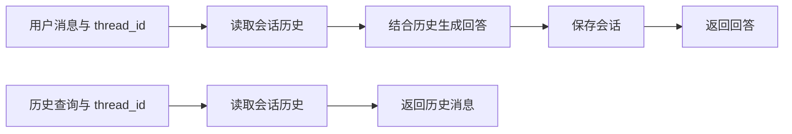
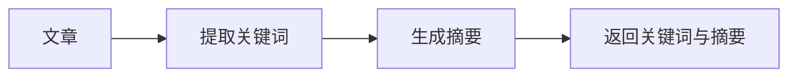
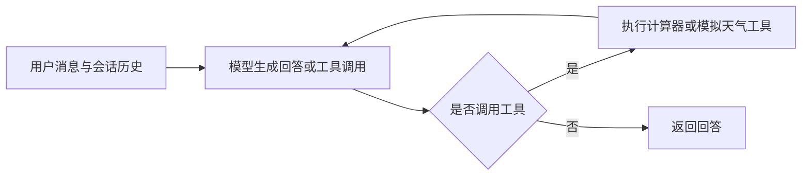
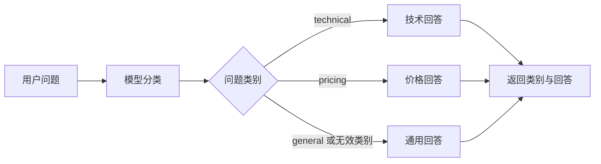
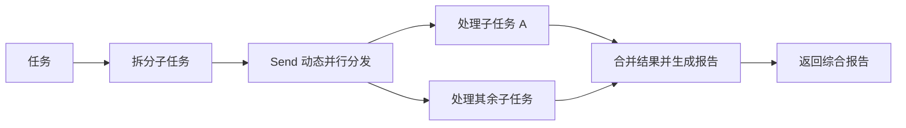
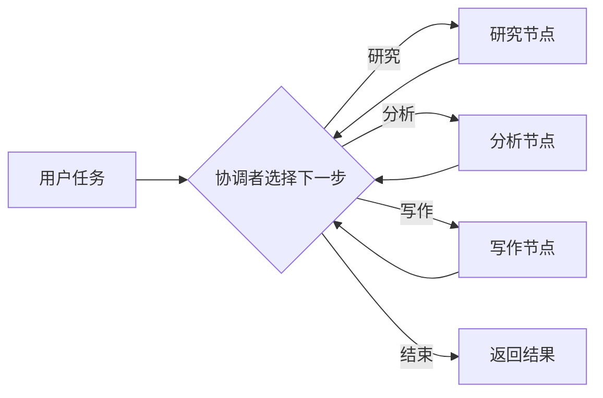
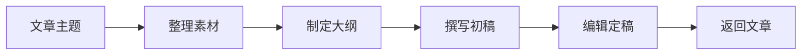
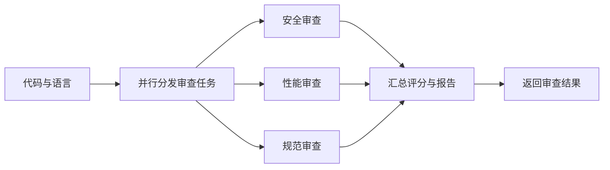
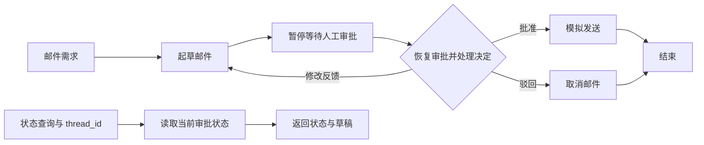

# Graph 工作流

默认入口为 `index.py`，具体需求分别放在同级 Python 文件中。模型复用 `app.config.llm`。

| 文件              | 用途                                             |
| ----------------- | ------------------------------------------------ |
| chat.py           | 带历史的对话、历史查询                           |
| article.py        | 关键词和摘要                                     |
| react_agent.py    | 两数四则运算、模拟天气工具调用；组合计算分步调用 |
| routing.py        | 技术、价格、通用问题分类                         |
| parallel.py       | 拆分、并行处理、汇总                             |
| supervisor.py     | 研究、分析、写作节点调度                         |
| pipeline.py       | 素材、大纲、初稿、定稿                           |
| code_review.py    | 安全、性能、规范审查                             |
| email_approval.py | 起草、人工审批、修改及状态查询                   |

## 文件流程图

### chat.py

### article.py

### react_agent.py

### routing.py

### parallel.py

子任务数量由拆分结果决定，最多 3 个；空输出时使用原任务。

### supervisor.py

每个工作节点最多执行一次，执行顺序由协调者决定。

### pipeline.py

### code_review.py

### email_approval.py

