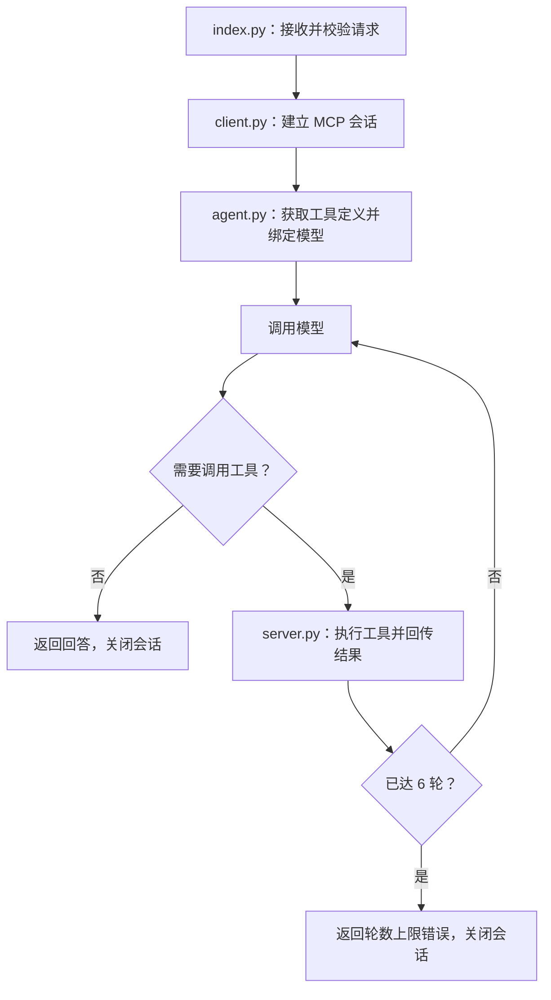

# MCP Agent 执行流程

## 关键点

- **会话生命周期**:每个请求独立调用一次 `open_session()`,请求结束即关闭 stdio 会话并回收子进程。
- **循环上限**:`MAX_ROUNDS = 6`,用尽仍要求调用工具时返回 `error: max_rounds_reached`。
- **工具超时**:单次工具调用 `read_timeout_seconds = 30`。工具函数内部抛出的异常由 MCP 包装成 `isError: true` 的正常结果返回,只有会话级异常才落到 agent 的 `except`(转成「工具调用失败: ...」文本)。两条路径都不中断流程,模型会据此如实回答而非编造。
- **工具说明**:`read_file` 与 `get_weather` 为演示工具,返回固定模拟内容;`query_database` 真实查询 `student` 表。
